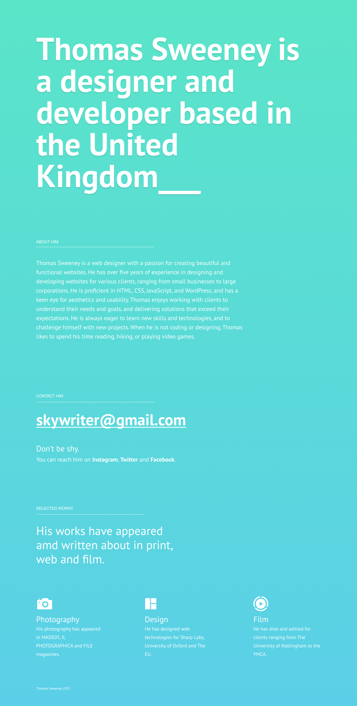

# One page CV Template

Instructions

- Fork this repository
- Clone your new freshly forked repositry into VSCode
- Using the Figma file as a guide try to recreate the design using CSS and HTML. *Use your own name and details. If stuck for text use AI text generation*
- Push your completed files back to GitHub
- Put the site live using GitHub Pages. You now have a live one page C.V.

## Rescources

[Figma Document](https://www.figma.com/file/nluU8xLNXkiRFXOkgz7Nlk/Untitled?type=design&node-id=0%3A1&t=pM52QXZUzHNwUfSL-1)
[PT Sans Font](https://fonts.google.com/specimen/PT+Sans)

